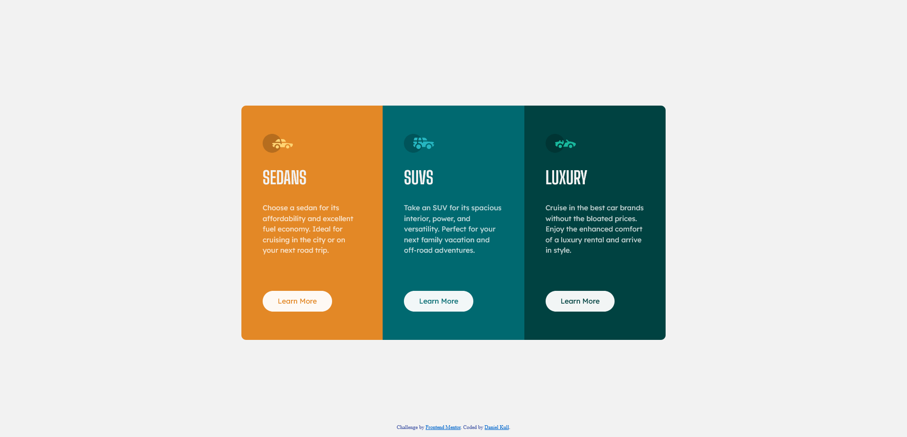

# Frontend Mentor - 3-column preview card component solution

This is a solution to the [3-column preview card component challenge on Frontend Mentor](https://www.frontendmentor.io/challenges/3column-preview-card-component-pH92eAR2-). Frontend Mentor challenges help you improve your coding skills by building realistic projects.

## Table of contents

- [Overview](#overview)
  - [The challenge](#the-challenge)
  - [Screenshot](#screenshot)
  - [Links](#links)
- [My process](#my-process)
  - [Built with](#built-with)
  - [What I learned](#what-i-learned)
  - [Useful resources](#useful-resources)
- [Author](#author)
- [Acknowledgments](#acknowledgments)

## Overview

### The challenge

Users should be able to:

- View the optimal layout depending on their device's screen size
- See hover states for interactive elements

### Screenshot




### Links

- Solution URL: [GitHub repository](https://github.com/danielkull/FrontM-3-column-preview-card-component-main)
- Live Site URL: [Live site from GitHub](https://danielkull.github.io/FrontM-3-column-preview-card-component-main/)

## My process

### Built with

- Semantic HTML5 markup
- CSS custom properties
- CSS Grid
- @media screen for the breakpoint

### What I learned

Use this section to recap over some of your major learnings while working through this project. Writing these out and providing code samples of areas you want to highlight is a great way to reinforce your own knowledge.

Learned that with scale in combination with transform, you can change the the width (first value) and height (second value) of the text to your liking. Also not commenting the right fonts out from loading, might be even better.

```css
h1 {
  font-family: "Big Shoulders Display", cursive;
  text-transform: uppercase;
  color: var(--heading-color);
  font-size: 2.5rem;
  transform: scale(1, 1.5);
}
```

With mix-blend-mode: screen, you can use the background color behind your element and use its color.

```css
.learn-more {
  padding: 1rem 2rem;
  border: 0px solid transparent;
  border-radius: 30px 30px;
  background-color: var(--buttons-color);
  mix-blend-mode: screen;
  font-weight: bold;
}
```

### Useful resources

- [Kevin Powell: Easy sticky footer - stop a footer from floating up a short page!](https://www.youtube.com/watch?v=yc2olxLgKLk&t=304s) - Creat content and helpt me do put the footer on the ground.
- [Robin Rendle: CSS Tricks](https://css-tricks.com/almanac/properties/m/mix-blend-mode/) - His article helpt me to use mix-blend-mode to change the color of the button with the background-color of the parent element. Not having to define the color each time.

## Author

- GitHub Page - [Daniel Kull](https://github.com/danielkull)
- Frontend Mentor - [@danielkull](https://www.frontendmentor.io/profile/danielkull)

## Acknowledgments

My thanks goes again to the Coding-bootcamps-eu, it's teachers and fellow students. Also I want to give a big thank you to all people who create content/tuorials or examples for free.
